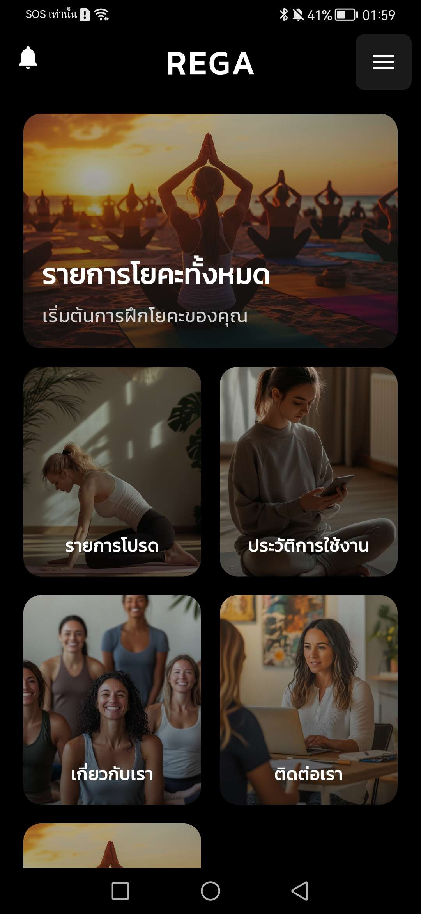
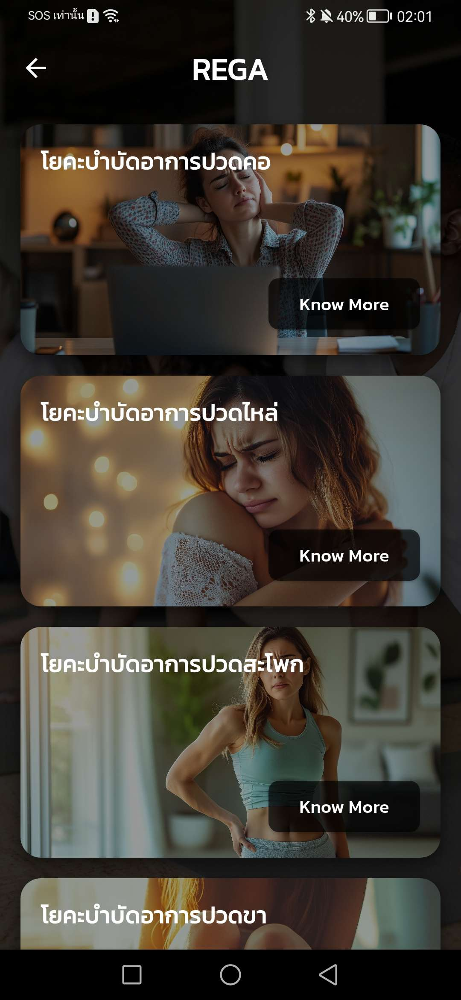
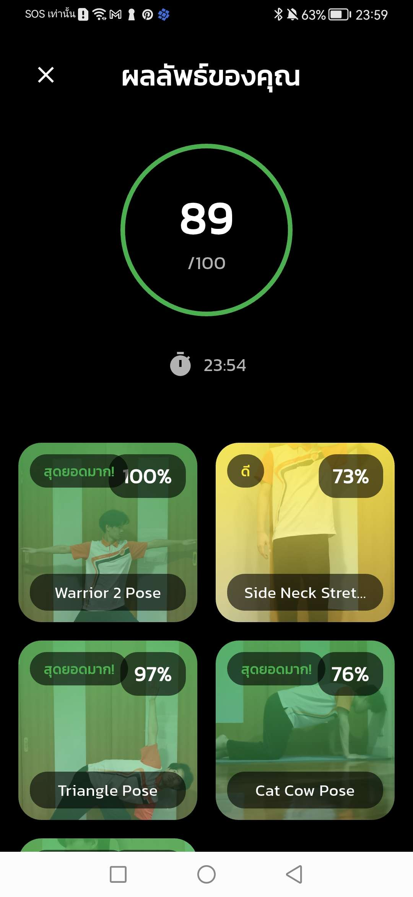
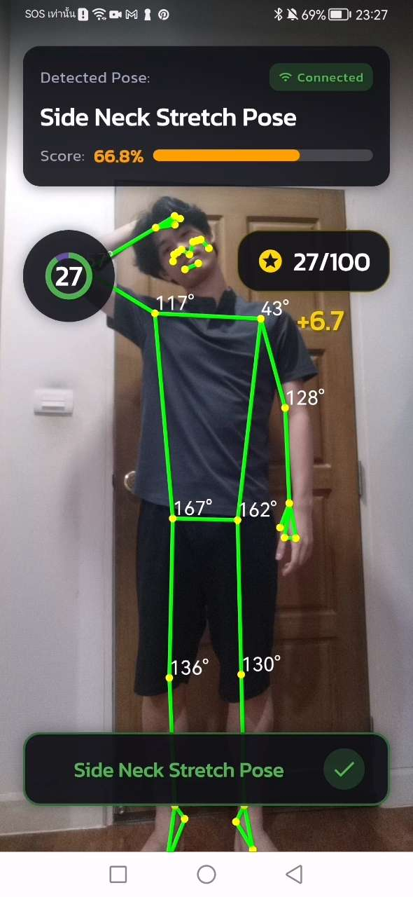
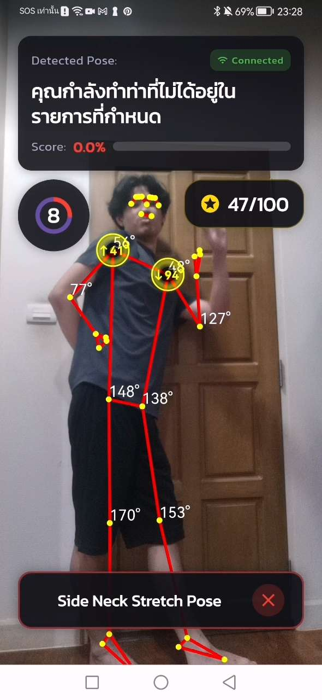

<!-- # regaproject

A project focused on community-driven experiences.

---

# Setting Up `google-services.json` in Your Flutter Project

## 📥 Local Setup: Manually Download `google-services.json`
When working on your local machine, you must manually download and place `google-services.json` in the correct directory.

### 📌 Steps to Get `google-services.json` Locally:
1. **Go to Firebase Console**: [Firebase Console](https://console.firebase.google.com/)
2. **Select Your Project** → Click on **Project Settings** ⚙️
3. Scroll down to **"Your apps"** → Select **Android**
4. Click **Download `google-services.json`**
5. Place it inside your Flutter project at:
   ```bash
   android/app/google-services.json
   ```

### 🚫 Ignore `google-services.json` from Git Commits
To prevent accidental commits, add this line to your `.gitignore` file:

```bash
android/app/google-services.json
```

This ensures that sensitive configuration details do not get exposed in your version control system.

---

# 🔧 Setting Up Environment Variables
To securely store Firebase credentials, add the following variables to your `.env` file:\
find this value in firebase in project setting
```ini
FIREBASE_API_KEY=
FIREBASE_APP_ID=
FIREBASE_MESSAGING_SENDER_ID=
FIREBASE_PROJECT_ID=
FIREBASE_AUTH_DOMAIN=PROJECT_ID+.firebaseapp.com
FIREBASE_STORAGE_BUCKET=
FIREBASE_MEASUREMENT_ID=
FIREBASE_IOS_CLIENT_ID=
FIREBASE_IOS_BUNDLE_ID=
```

Make sure to **never commit** your `.env` file to version control to keep your credentials safe! 🚀

Phone distance 180 - 190 cm
Phone high 60 cm -->

# Rega (2024–2025)

> A yoga training mobile app with real-time pose detection and scoring.

Rega is a mobile application designed to help users practice yoga efficiently using AI. It features real-time pose detection using Mediapipe, pose prediction using a custom AI model, and scoring feedback to improve form and consistency. The app is built with Flutter for the frontend, uses Flask for model inference, and leverages Google Firebase for backend services and data storage.

---

## 📱 App Screenshots

<div align="center">
  
  
  
</div>

---

## 🎬 App in Action

<div align="center">
  
  
</div>

---

## 🚀 Key Features

- 📐 Real-time yoga pose detection with Mediapipe
- 🤖 AI-based yoga pose classification and feedback
- 🧘 Instant scoring system for pose accuracy
- 💡 Intuitive UI built with Flutter
- 🔌 Backend integration using Firebase
- 🧪 AI inference through Flask API

---

## 🛠 Tech Stack

- **Frontend:** Flutter
- **AI Model + Inference:** Python, Mediapipe, Flask
- **Backend:** Firebase Firestore, Firebase Auth, Firebase Storage
- **Other Tools:** Google ML Kit, Android Studio

---

## 🧑‍💻 Developers

Project Owner & Developer
-Tanaphat Takulpukdichumpon
-Kittitat poonnayom

---

## 📁 Project Structure

